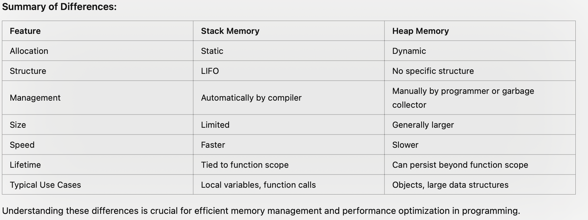

# c_sharp_queues

| Data Structure | Ordering       | Operations     |    Type        |
| -------------- | -------------- | -------------- | -------------- |
| Queue          | FIFO           |  add(item):    |    Abstract    |
|                |                |  remove()      |                |
|                |                |  peek()        |                |
|                |                |  isEmpty()     |                |
| Priority Queue | FIFO           |  add(item):    |    Abstract    |
|                |                |  remove()      |                |
|                |                |  peek()        |                |
|                |                |  isEmpty()     |                |
|                |                |                |                |

Deleting objects from memory. 

Stack Variabels: 
- static memory allocation
- memory size and lifetime are determined at compile time 
- ex: local variables, function parameters, and return addresses 
- LIFO structure: last allocated memory is the first to be deallocated  
- Size limit: stack memory is usually limited in size and can lead to stack overflow if too much memory is allocated (ex: deep recursion)
- Speed: access to stack memory is fast due to its contiguous nature (memory blocks are allocated one after another is a single continuous block without gaps) and efficient management
- Variables are deallocated automatically when function in which they were created returns  

heap variables 
- Memory Allocation: dynamic memory allocation (size and lifetime can be determined at runtime)
- Data Stroage: objects, data structures (ex: linked lists, trees), and large data needed to persist beyond function scope 
- Structure: Does not have specific structure. Memory allocation and deallocation are managed via pointers and can occure in any order 
- Size Limit: Larger and more flexible than stack. Improper management can lead to memory leaks and fragmentation 
- Speed: slower compared to stack due to dynamic memory management 
- Scope: Variables in heap remain until explicityly deallocated using functions like free C or are garbage collected in languages like java and python 

